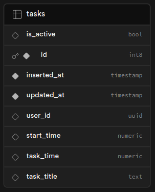

# ionic-trackrrr - Track your time without hassle !

This project was bootstrapped with [Create React App](https://github.com/facebook/create-react-app).

### Supabase:

- Authentification
- Data Storage

It needs a `tasks` table to work properly. The `tasks` table looks like this:

## Available Scripts

In the project directory, you can run:

### `yarn start` or `yarn serve`

Runs the app in the development mode.\
Open [http://localhost:3000](http://localhost:3000) to view it in the browser.

The page will reload if you make edits.\
You will also see any lint errors in the console.

### `yarn build`

Builds the app for production to the `build` folder.\
It correctly bundles React in production mode and optimizes the build for the best performance.

The build is minified and the filenames include the hashes.\
Your app is ready to be deployed!

### `yarn build:android`

Builds the app for production and prepare the `android` project to be opened in `android studio`.

### Todo

- [x] Upgrade to last version of React
- [ ] Initialize new added timer in `running` status
- [ ] Create a PWA app
- [ ] Improve UI (add loading data indicator, use ionic icons)
- [ ] Use Google/Facebook as `auth providers` instead of/with GitHub
- [ ] Document `tasks` table schema
- [ ] Improve errors handling
